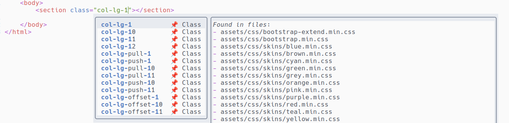
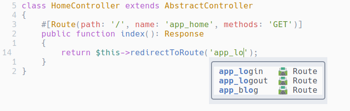
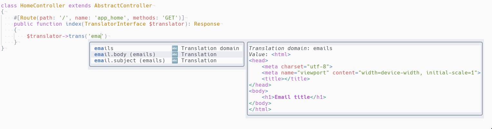

# cmp-symfony

[nvim-cmp](https://github.com/hrsh7th/nvim-cmp) source for many
Symfony completions:
- HTML classes
- Symfony form options
- Symfony routes
- Symfony translations

## Required deps
- [fd](https://github.com/sharkdp/fd) for twig templates
- [jq](https://github.com/jqlang/jq) for form options
- [nvim-treesitter](https://github.com/nvim-treesitter/nvim-treesitter) for form options (with PHP parser)

## Global setup

```lua
require('cmp').setup({
  sources = {
    { name = 'form_options' },
    { name = 'html_class' },
    { name = 'symfony_routes' },
    { name = 'symfony_translations' },
  },
})
```

## Available sources

### Form options
Form option completion.

#### Prerequisite
The completion is based on a file named `autocomplete_form_type.json`
at the root of the project. It consists of a JSON array for each
FormType as key and all available options as values.  
This file is obtained iterating over the results of:  
```bash
bin/console debug:form --format json # gets all form types
bin/console debug:form --format json ChoiceType # for each for type
```

Here is the script I'm using to create this file:  
<details>
<summary>View script</summary>

```bash  
#!/usr/bin/env bash

function create_json() {
    echo "$1" | jq -c '{
        (."class" | split("\\") | last): (
            [
                .class as $class |
                (.options.own // [] | map({(.): $class}) | add) as $own |
                (.options.overridden // {} | to_entries | map({key: .value[], value: .key}) | from_entries) as $overridden |
                (.options.parent // {} | to_entries | map({key: .value[], value: .key}) | from_entries) as $parent |
                (.options.extension // {} | to_entries | map({key: .value[], value: .key}) | from_entries) as $extension |
                $own + $overridden + $parent + $extension
            ] | add
        )
    }'
}

json=$(docker compose run --rm franken-cli bin/console debug:form --format json)

echo "" > /tmp/autocomplete_form_type.json

builtin_types=$(echo "$json" | jq -r ".builtin_form_types[]")
service_types=$(echo "$json" | jq -r ".service_form_types[]")

builtin_types_count=$(echo "$builtin_types" | wc -l)
service_types_count=$(echo "$service_types" | wc -l)

counter=0
echo "[INFO] Creating builtin types"
for builtin_type in $builtin_types; do
    counter=$((counter+1))
    echo "$counter/$builtin_types_count: $builtin_type"
    json=$(docker compose exec franken bin/console debug:form --format json "$builtin_type")

    create_json "$json" >> /tmp/autocomplete_form_type.json
done

counter=0
echo "[INFO] Creating service types"
for service_type in $service_types; do
    counter=$((counter+1))
    echo "$counter/$service_types_count: $service_type"
    json=$(docker compose exec franken bin/console debug:form --format json "$service_type")

    create_json "$json" >> /tmp/autocomplete_form_type.json
done

jq --slurp 'add' /tmp/autocomplete_form_type.json > ./autocomplete_form_type.json
```
</details>

This is rather hard to maintain, so duplicated FormType are not preserved.

#### Triggers

The plugin is activated for `php` filetypes.  
The trigger character is a single quote, and the current buffer must `extends AbstractType`.  
The completion is triggered only on the left side of `=>`.

### HTML classes
This plugin autocompletes class tags using a pre-generated json file.  



#### Prerequisites
A json file must be generated first. It contains one json object
per line, with two keys:
- _class_: the html class to autocomplete
- _files_: a json array containing all files where this class is
defined

Here is an example:
```json
{"class":"my-first-class","files":["/path/to/file.css","/path/to/file.min.css"]}
{"class":"my-second-class","files":["/path/to/file.css"]}
```

#### Generate the json file
The file is generated with this bash script:  
<details>
<summary>View script</summary>

```bash
#!/usr/bin/env bash

temp_dir=$(mktemp -d)

# Get all classes in css files, in json format, then use jq to get all matching
# results and format them: {"class":"my-first-class","file":"/path/to/file.css"}
rg "\.[a-z][a-z0-9-]{3,}" -tcss --no-filename --json assets | jq -c '. 
                                    | select(.type == "match") 
                                    | {class: .data.submatches[].match.text, file: .data.path.text}' > $temp_dir/raw.json

# Sort and uniq input file
cat $temp_dir/raw.json | sort | uniq > $temp_dir/uniq.json

# Group results by class name and add a files key containing all files
cat $temp_dir/uniq.json | jq -sc 'map(. + {data: [{class: [.class], file: [.file]}]})
                                    | group_by(.class)[]
                                    | .[0] + {files: [.[].data[].file | add]}
                                    | del (.data, .file)' > $temp_dir/grouped.json

# Remove trailing dot in class name
sed -i 's/"\./"/' $temp_dir/grouped.json

mv $temp_dir/grouped.json ~/generated_html_classes.json
```
</details>

#### Triggers

The plugin is activated for `twig` and `html` filetypes.  
Autocompletion is triggered for double quotes and space
characters.

### Symfony routes

The source is using `./var/cache/dev/url_generating_routes.php` file.

This plugin is a very simple implementation, the autocomplete won't work
if the above file doesn't exist.



Routes are refreshed every 30 seconds.

#### Triggers

The plugin is activated for `php` and `twig` filetypes.  
The trigger character is a single quote, and the line must contains
`route`, `path` or `url`. This covers most of Symfony and twig
functions used to generate URLs:
- PHP
  - redirectToRoute
  - $router->generate
- Twig
  - path
  - url

### Symfony translations

The source is using `./var/cache/dev/translations/catalog.fr.SHA1.php` file.

This plugin the autocomplete won't work if the above file doesn't exist.



Translations are refreshed every 60 seconds.

#### Features
- completes translation domains
- documentation displays full french translation value
- `->addFlash` only displays `flashes_messages` translations
- `message` attribute only displays `validators` translations

#### Triggers

The plugin is activated for `php` and `twig` filetypes.  
The trigger character is a single quote, and the line must contains
`trans`, `addflash`, `message:`, `'label' =>` or `'choice_label' =>`. This covers most of Symfony and twig
translation functions:
- PHP
  - $translation->trans
  - $this->addFlash
  - message attribute for validators
  - form labels
- Twig
  - ''|trans({}, '')
